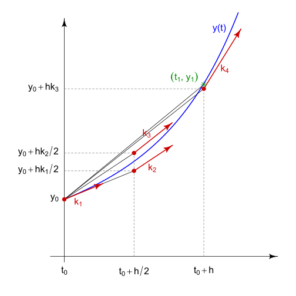

# Runge-Kutta methods

In numerical analysis, the Runge–Kutta methods are a family of implicit and explicit iterative methods, which include the Euler method, used in temporal discretization for the approximate solutions of simultaneous nonlinear equations.

在数值分析中，龙格-库塔方法是一系列隐式和显式迭代方法，其中包括欧拉方法，用于时间离散化求解联立非线性方程的近似解。

These methods were developed around 1900 by the German mathematicians Carl Runge and Wilhelm Kutta.

这些方法是在1900年左右由德国数学家卡尔·龙格和威廉·库塔提出的。

## The Runge-Kutta method

The most widely known member of the Runge–Kutta family is generally referred to as "RK4", the "classic Runge–Kutta method" or simply as "the Runge–Kutta method".

Let an initial value problem be specified as follows:

$$
{\displaystyle {\frac {dy}{dt}}=f(t,y),\quad y(t_{0})=y_{0}}
$$
Here ${\displaystyle y}$ is an unknown function (scalar or vector) of time ${\displaystyle t}$, which we would like to approximate; we are told that ${\displaystyle {\frac {dy}{dt}}}$, the rate at which ${\displaystyle y}$ changes, is a function of ${\displaystyle t}$ and of ${\displaystyle y}$ itself. At the initial time ${\displaystyle t_{0}}$ the corresponding ${\displaystyle y}$ value is ${\displaystyle y_{0}}$. The function ${\displaystyle f}$ and the initial conditions ${\displaystyle t_{0}}$, ${\displaystyle y_{0}}$ are given.

Slopes used by the classical Runge-Kutta method

Now we pick a step-size $h > 0$ and define:

$$
{\displaystyle {\begin{aligned}y_{n+1}&=y_{n}+{\frac {h}{6}}\left(k_{1}+2k_{2}+2k_{3}+k_{4}\right),\\t_{n+1}&=t_{n}+h\\\end{aligned}}}
$$
for $n = 0, 1, 2, 3, ...$, using
$$
{\displaystyle {\begin{aligned}k_{1}&=\ f(t_{n},y_{n}),\\k_{2}&=\ f\!\left(t_{n}+{\frac {h}{2}},y_{n}+h{\frac {k_{1}}{2}}\right),\\k_{3}&=\ f\!\left(t_{n}+{\frac {h}{2}},y_{n}+h{\frac {k_{2}}{2}}\right),\\k_{4}&=\ f\!\left(t_{n}+h,y_{n}+hk_{3}\right).\end{aligned}}}
$$

> Note: the above equations have different but equivalent definitions in different texts.

Here ${\displaystyle y_{n+1}}$ is the RK4 approximation of ${\displaystyle y(t_{n+1})}$, and the next value ${\displaystyle y_{n+1}}$ is determined by the present value ${\displaystyle y_{n}}$ plus the weighted average of four increments, where each increment is the product of the size of the interval $h$, and an estimated slope specified by function $f$ on the right-hand side of the differential equation.

- ${\displaystyle k_{1}}$ is the slope at the beginning of the interval, using ${\displaystyle y}$ (Euler's method);
- ${\displaystyle k_{2}}$ is the slope at the midpoint of the interval, using ${\displaystyle y}$ and ${\displaystyle k_{1}}$;
- ${\displaystyle k_{3}}$ is again the slope at the midpoint, but now using ${\displaystyle y}$ and ${\displaystyle k_{2}}$;
- ${\displaystyle k_{4}}$ is the slope at the end of the interval, using ${\displaystyle y}$ and ${\displaystyle k_{3}}$.

In averaging the four slopes, greater weight is given to the slopes at the midpoint. If ${\displaystyle f}$ is independent of ${\displaystyle y}$, so that the differential equation is equivalent to a simple integral, then RK4 is Simpson's rule.

The RK4 method is a fourth-order method, meaning that the local truncation error is on the order of ${\displaystyle O(h^{5})}$, while the total accumulated error is on the order of ${\displaystyle O(h^{4})}$.

In many practical applications the function ${\displaystyle f}$ is independent of ${\displaystyle t}$ (so called autonomous system, or time-invariant system, especially in physics), and their increments are not computed at all and not passed to function ${\displaystyle f}$, with only the final formula for ${\displaystyle t_{n+1}}$ used.

在许多实际应用中，函数${\displaystyle f}$独立于${\displaystyle t}$（也就是所谓的自治系统，或定常系统，特别是在物理学中），它们的增量根本不计算，也不传递给函数${\displaystyle f}$，只使用${\displaystyle t_{n+1}}$的公式。

# References

[Runge-Kutta methods @wikipedia](https://en.wikipedia.org/wiki/Runge%E2%80%93Kutta_methods)